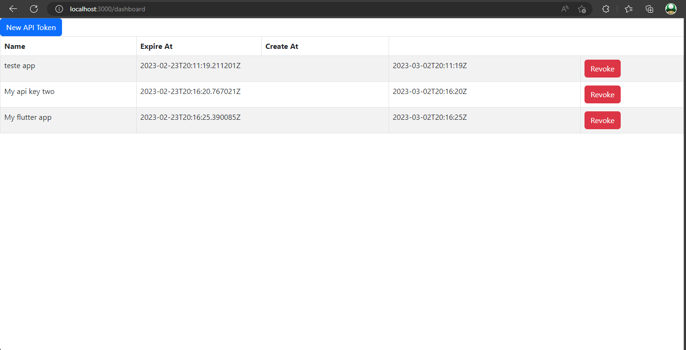
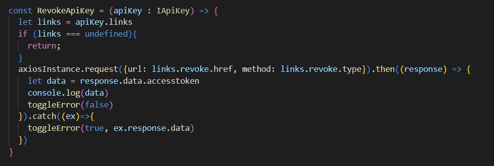
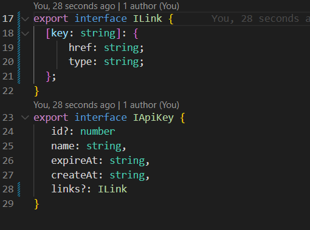

# github.com/brutalzinn/api-task-list
# STILL IN DEVELOPMENT

### A api to manage tasks by repositories and sync between a CLI and mobile application. Utils for people that likes to wrotten many annotations.

[Swagger documentation](https://brutalzinn.github.io/api-task-list/)
# This api its a backend for the bellow projects

- https://github.com/brutalzinn/web-task-list
- https://github.com/brutalzinn/cli-task-list

# Implementations

- [x] Authentication
- [x] Tasks route
- [x] Users route
- [x] Authentication route
- [x] Api key route ( revoke and generate )
- [x] Table users
- [x] Table tasks
- [x] Table api keys
- [x] Hypermedia links base
- [ ] Swagger
- [ ] Firebase integration

# Purpose of existence

## This project is designed to my estudies case of hypermedia REST apis.

#### This example shows a repository paging route. These routes list all repositories created by the user. The cool part here is that the API client can see all available actions to perform.

#### This example shows apikey list route. This route list all api keys of current authenticated user. The frontend application can uses the hypermedia references to perform actions with the api keys.

#### This example shows the web interface that lists API keys for an authenticated user. The revoke button uses the hypermedia links object to get the url that performs the revoke action of an api key.

#### This example shows how to uses Axios library and typescript to consume the hypermedia link by a web application.

#### This example shows how a hypermedia link can easily be represented by a interface.

### References

- [api design with hypermedia rest](https://www.mscharhag.com/api-design/hypermedia-rest)