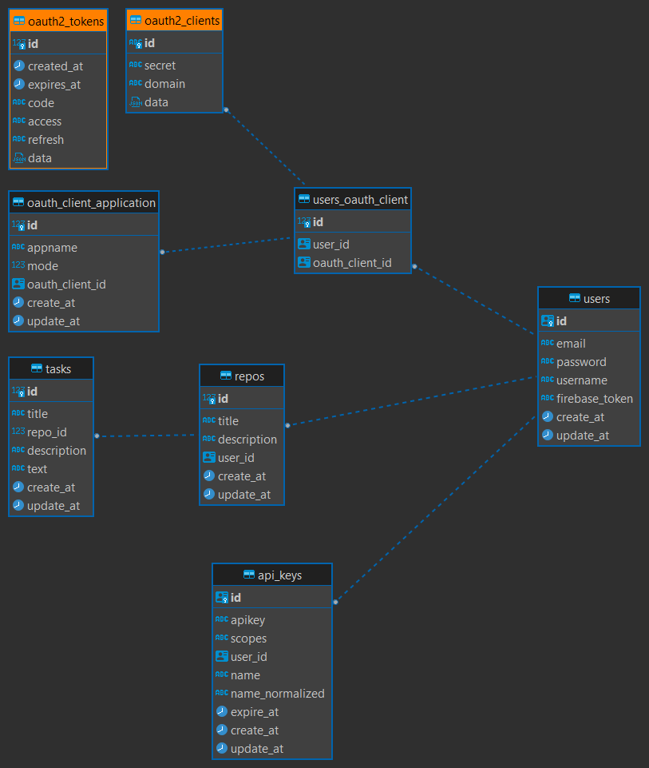

# github.com/brutalzinn/api-task-list
# STILL IN DEVELOPMENT

### A api to manage tasks by repositories and sync between a CLI and mobile application. Utils for people that likes to wrotten many annotations.

[Swagger documentation](https://brutalzinn.github.io/api-task-list/)
# This api its a backend for the bellow projects

- https://github.com/brutalzinn/web-task-list
- https://github.com/brutalzinn/cli-task-list

# Goals

- [x] Tasks routes ( put, patch, delete, get, post)
- [x] Users routes ( put, delete, get )
- [x] Login routes ( post )
- [x] Register routes ( post )
- [x] Api key routes ( delete, post, get )
- [x] OAuth2 routes ( delete, post, get )
- [x] Table users
- [x] Table tasks
- [x] Table repos
- [x] Table api_keys
- [x] Table users_oauth_client
- [x] Table oauth_client_application
- [x] Hypermedia links base
- [x] Hypermedia links middleware
- [ ] Go tests
- [ ] CI/CD to digital ocean with Dokku
- [ ] Swagger auto documentation
- [ ] Notification channel for discord, twitter and firebase
- [ ] Error log with MongoDB
- [ ] Generic error middleware handler
- [ ] Configure Dockerfile to uses air to hot reload

# Table relations

#### Version 3 by dbeaver ( still in development )

The orange tables is created by go package oauth2. So i dont have this managed resource. To do my own oauth2 implementation of my business rule, i made a many to many helper table. 
# Purpose of existence

This project is designed to my estudies case of hypermedia REST apis(HATEOAS) and now oauth2 flux handle.

#### This example shows a repository paging route. These routes list all repositories created by the user. The cool part here is that the API client can see all available actions to perform.

#### This example shows apikey list route. This route list all api keys of current authenticated user. The frontend application can uses the hypermedia references to perform actions with the api keys.

# Web Example under construction

[Web App](https://github.com/brutalzinn/web-task-list)

Web app is a react frontend application to perform login and manage user api keys and oauth2.
# Dart CLI under construction

[Dart CLI](https://github.com/brutalzinn/cli-task-list)

Dart cli is a project designed to use this API.
 This is the principal frontend application that will interact with this api. The ideia is use oauth2 auth flow to CLi authenticates and perform actions. The user can create tasks and repos using this.
### References

- [api design with hypermedia rest](https://www.mscharhag.com/api-design/hypermedia-rest)